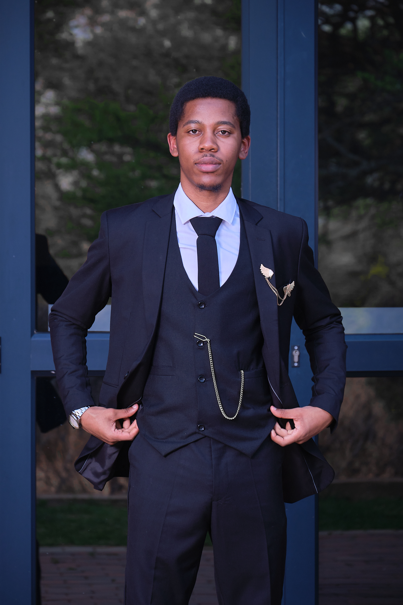

### Hi there, I'm [Caron](https://mrsathekge.github.io/ds-portfolio/) 

)
 
Kaggle: https://www.kaggle.com/caronsathekge
---
I am a Mathematical & Computer Science graduate, with experience as an intern Data Scientist at ExploreAI Academy.
---
Proficient with SQL, Python, Power BI, Exploratory Data Analysis, Machine Learning, AWS EC2.

**Highly Skilled In:**
Team Leading, Project Management, Time Management, Communication, Data Science Life Cycle.
---
Machine Learning models I've worked on:
- Regression: Linear Regression, Decision Tree, Random Forest, XGBoost, Voting Regressor, Stacking Regressor.
- Classification: Logistic Regression, Random Forest Classifier, KNN, Naive Bayes Classifier.
- Unsupervised: Content-based and collaborative filtering using Singular Value Decomposition, Non-negative Matrix Factorization, Clustering to group movies together based on their similarity in terms of genre, director, actors, and other features, and Principal Component Analysis(PCA) to identify the most important features that contribute to a user's movie preferences.

### Languages and tools ⚙️
AWS, Jupyter Notebook, Git and GitHub, Virtual Studio Code, PowerBI, Trello, Discord, Slack.

   

---

Feel free to view more on Linkedin 😄 .

<!--
**MrSathekge/MrSathekge** is a ✨ _special_ ✨ repository because its `README.md` (this file) appears on your GitHub profile.

Here are some ideas to get you started:

- 🔭 I’m currently working on ...
- 🌱 I’m currently learning ...
- 👯 I’m looking to collaborate on ...
- 🤔 I’m looking for help with ...
- 💬 Ask me about ...
- 📫 How to reach me: ...
- 😄 Pronouns: ...
- ⚡ Fun fact: ...
-->
